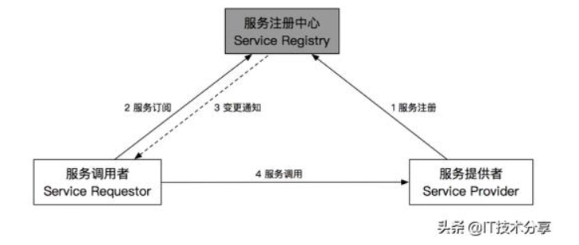

# 1.单体架构及其存在的不足

# 2. 微服务

## 2.1 什么是微服务?

微服务最初是由Martin Flowler在2014年写的一篇文章《MicroServices》中提出来的。其主要概念是：

微服务架构风格，就是将单一程序开发成一个微服务，每个微服务运行在自己的进程中。并使用轻量级通信机制，通常是HTTP RESULT API。这些服务围绕业务能力来划分构建的，并通过完全自动化部署机制来独立部署。这些服务可以使用不同的编程语言，以及不同的数据库存储技术，以保证最低限度的集中式管理。

微服务有以下特点：

- 按业务划分为一个独立运行的程序，即服务单元。

- 服务之间通过HTTP协议相互通信。

  **其通信机制是不可靠的，虽然成功率很高，但还是会有失败的时候。**

- 自动化部署。

- 可以用不同的编程语言。

- 可以用不同的存储技术。

- 服务集中化管理。

- 微服务是一个分布式系统

  分布式系统比单体系统更加复杂，主要体现在服务的独立性和服务相互调用的可靠性，以及分布式事务，全局锁，全局Id等。由于服务的相互依赖，可能会导致整个系统的不可用，这就是"雪崩效应"。相应的措施：熔断机制。

  SpringCloud构建的微服务系统中，采用了熔断器(Hystrix组件的Circuit Breaker)

微服务架构中，有三大难题，那就是服务故障的传播性，服务的划分和分布式事务。

# 3. Spring Cloud简介

## 1. 微服务应该具备的功能

### 1.1 服务的注册与发现

### 1.2 服务的负载均衡

### 1.3 服务的容错

### 1.4 服务网关

### 1.5 服务配置的统一管理

### 1.6 服务链路追踪

## 4. Spring Cloud

常用组件:

#### 1. 服务注册和发现组件Eureka

spring cloud也支持Consul和Zookeeper,用于注册和发现服务。

#### 2. 熔断组件Hystrix

#### 3. 负载均衡组件Ribbon

#### 4.  路由网关Zuul

上述组件都来自于Netflix的公司，统一称为Spring Cloud Netflix。

#### 5. Spring Cloud Config

