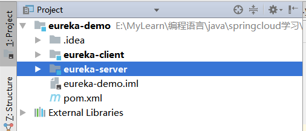

# 服务注册和发现Eureka

## 1. Eureka简介

和Consul,Zookeeper类似，Eureka是一个用于服务注册和发现的组件。Eureka分为Eureka Server和Eureka Client,Eureka Server为Eureka服务注册中心， Eureka Client为Eureka客户端。

Eureka基本架构:


Register Service:服务注册中心，它是一个Eureka Server,提供服务注册和发现的功能。

Provider Service:服务提供者，它是一个Eureka Client,提供服务。

Consumer Service:服务消费者，它是一个Eureka Client,消费服务。

**服务消费的基本流程：**

首先需要一个服务注册中心Eureka Server,服务提供者Eureka Client向服务中心Eureka Server注册,将自己的信息(比如服务名，服务的IP地址和端口信息等)通过REST API的形式提交给服务注册中心。同样，服务消费者,Eureka Client也需要向服务注册中心Eureka Server注册，同时服务消费者获取一份服务注册列表的信息，该列表包含了所有向服务注册中心Eureka Server注册的服务信息。获取服务注册列表信息之后，服务消费者就知道服务提供者的IP地址和端口等信息，可以通过Http远程调度来消费服务提供者的服务。

## 2. 代码编写Eureka Server

本工程采用多Module的结构，实际创建时发现:IDEA2016.1.2版本创建子Module时总是与父Module在同一目录,采用2017，2019版本没有此问题，目录结构:



主Module的pom.xml文件如下:

```pom.xml
<?xml version="1.0" encoding="UTF-8"?>
<project xmlns="http://maven.apache.org/POM/4.0.0"
         xmlns:xsi="http://www.w3.org/2001/XMLSchema-instance"
         xsi:schemaLocation="http://maven.apache.org/POM/4.0.0 http://maven.apache.org/xsd/maven-4.0.0.xsd">
    <modelVersion>4.0.0</modelVersion>

    <groupId>com.zhangxp</groupId>
    <artifactId>eureka-demo</artifactId>
    <packaging>pom</packaging>
    <version>1.0-SNAPSHOT</version>
    <modules>
        <module>eureka-server</module>
        <module>eureka-client</module>
    </modules>

    <parent>
        <groupId>org.springframework.boot</groupId>
        <artifactId>spring-boot-starter-parent</artifactId>
        <version>2.2.6.RELEASE</version>
        <relativePath/> <!-- lookup parent from repository -->
    </parent>

    <properties>
        <project.build.sourceEncoding>UTF-8</project.build.sourceEncoding>
        <project.reporting.outputEncoding>UTF-8</project.reporting.outputEncoding>
        <java.version>1.8</java.version>
        <spring-cloud.version>Hoxton.RELEASE</spring-cloud.version>
    </properties>

    <dependencyManagement>
        <dependencies>
            <dependency>
                <groupId>org.springframework.cloud</groupId>
                <artifactId>spring-cloud-dependencies</artifactId>
                <version>Hoxton.RELEASE</version>
                <type>pom</type>
                <scope>import</scope>
            </dependency>
        </dependencies>
    </dependencyManagement>

</project>
```

**需要注意的点:Spring Cloud和Spring Boot的版本有严格的对应关系,否则会报很多错误。另外，实际操作中,解决版本不一致报错时，不能单纯的改变版本号后，下载对应的jar包就可以解决报错，还需要手工删除Maver 仓库的spirngboot和springcloud相关包，重新下载才解决了报错。。。**

### 2.1 Eureka Serve代码:

```java
package com.zhangxp;

import org.springframework.boot.SpringApplication;
import org.springframework.boot.SpringBootConfiguration;
import org.springframework.boot.autoconfigure.EnableAutoConfiguration;
import org.springframework.boot.autoconfigure.SpringBootApplication;
import org.springframework.cloud.netflix.eureka.server.EnableEurekaServer;

/**
 * @author Administrator
 */
@EnableEurekaServer
@SpringBootApplication
public class EurekaServerApplication {
    public static void main(String[] args) {
        SpringApplication.run(EurekaServerApplication.class, args);
    }
}

```

pom.xml文件:

```pom.xml
<?xml version="1.0" encoding="UTF-8"?>
<project xmlns="http://maven.apache.org/POM/4.0.0"
         xmlns:xsi="http://www.w3.org/2001/XMLSchema-instance"
         xsi:schemaLocation="http://maven.apache.org/POM/4.0.0 http://maven.apache.org/xsd/maven-4.0.0.xsd">
    <parent>
        <artifactId>eureka-demo</artifactId>
        <groupId>com.zhangxp</groupId>
        <version>1.0-SNAPSHOT</version>
    </parent>
    <modelVersion>4.0.0</modelVersion>

    <artifactId>eureka-server</artifactId>

    <dependencies>
        <dependency>
            <groupId>org.springframework.cloud</groupId>
            <artifactId>spring-cloud-starter-netflix-eureka-server</artifactId>
        </dependency>

        <dependency>
            <groupId>org.springframework.boot</groupId>
            <artifactId>spring-boot-starter-web</artifactId>
        </dependency>

        <dependency>
            <groupId>org.springframework.boot</groupId>
            <artifactId>spring-boot-starter-test</artifactId>
            <scope>test</scope>
        </dependency>

        <dependency>
            <groupId>org.springframework.boot</groupId>
            <artifactId>spring-boot-starter-actuator</artifactId>
        </dependency>

    </dependencies>

    <build>
        <plugins>
            <plugin>
                <groupId>org.springframework.boot</groupId>
                <artifactId>spring-boot-maven-plugin</artifactId>
            </plugin>
        </plugins>
    </build>


</project>
```

application.yml配置:

```yaml
server:
  port: 8761
eureka:
  instance:
    hostname: localhost
    prefer-ip-address: true  # 注册时是否提交ip信息
  client:
    service-url:
      defaultZone: http://${eureka.instance.hostname}:${server.port}}/eureka/
    register-with-eureka: false  # 是否向自己注册
    fetch-registry: false # 是否向自己注册
  server:
    enable-self-preservation: false
```

**eureka配置心跳和剔除不可用服务**

1、注意
    改配置建议在开发和测试环境下使用，尽量不要在生产环境使用。

2、背景
    由于Eureka拥有自我保护机制，当其注册表里服务因为网络或其他原因出现故障而关停时，Eureka不会剔除服务注册，而是等待其修复。这是AP的一种实现。 

3、解决方案
    eureka server配置：

eureka:
  server:
    enable-self-preservation: false #关闭自我保护
    eviction-interval-timer-in-ms: 4000 #清理间隔（单位毫秒，默认是60*1000）
    eureka client配置：

eureka:
  instance:
    lease-expiration-duration-in-seconds: 30 #服务过期时间配置,超过这个时间没有接收到心跳EurekaServer就会将这个实例剔除
    lease-renewal-interval-in-seconds: 10 #服务刷新时间配置，每隔这个时间会主动心跳一次

### 2.2 Eureka Client代码:

pom.xml文件:

```pom.xml
<?xml version="1.0" encoding="UTF-8"?>
<project xmlns="http://maven.apache.org/POM/4.0.0"
         xmlns:xsi="http://www.w3.org/2001/XMLSchema-instance"
         xsi:schemaLocation="http://maven.apache.org/POM/4.0.0 http://maven.apache.org/xsd/maven-4.0.0.xsd">
    <parent>
        <artifactId>eureka-demo</artifactId>
        <groupId>com.zhangxp</groupId>
        <version>1.0-SNAPSHOT</version>
    </parent>
    <modelVersion>4.0.0</modelVersion>

    <artifactId>eureka-client</artifactId>

    <dependencies>
        <dependency>
            <groupId>org.springframework.cloud</groupId>
            <artifactId>spring-cloud-starter-netflix-eureka-server</artifactId>
        </dependency>

        <dependency>
            <groupId>org.springframework.boot</groupId>
            <artifactId>spring-boot-starter-web</artifactId>
        </dependency>

        <dependency>
            <groupId>org.springframework.boot</groupId>
            <artifactId>spring-boot-starter-test</artifactId>
            <scope>test</scope>
        </dependency>

        <dependency>
            <groupId>org.springframework.boot</groupId>
            <artifactId>spring-boot-starter-actuator</artifactId>
        </dependency>

    </dependencies>


</project>
```

application.yml

```yaml
eureka:
  client:
    service-url:
      defaultZone: http://localhost:8761/eureka/ # 服务注册地址
server:
  port: 8762
spring:
  application:
    name: eureka-client
```

java代码:

```java
package com.zhangxp;

import org.springframework.boot.SpringApplication;
import org.springframework.boot.autoconfigure.SpringBootApplication;
import org.springframework.cloud.netflix.eureka.EnableEurekaClient;

@SpringBootApplication
@EnableEurekaClient
public class EurekaClientApplication {
    public static void main(String[] args) {
        SpringApplication.run(EurekaClientApplication.class, args);
    }
}
```

controller代码:

```java
package com.zhangxp.controller;

import org.springframework.beans.factory.annotation.Value;
import org.springframework.web.bind.annotation.GetMapping;
import org.springframework.web.bind.annotation.RequestParam;
import org.springframework.web.bind.annotation.RestController;

@RestController
public class HiController {
    @Value("${server.port}")
    String port;

    @GetMapping("/hi")
    public String home(@RequestParam String name) {
        return "Hi" + name + ", i am from port: " + port;
    }
}
```

## 3.源码解析Eureka

### 3.1 Register服务注册

当Eureka Client向Eureka Server注册时，Eureka Client提供自身的元数据，比如IP地址，端口，运行状况指标的Url,主页地址等信息。

### 3.2 Renew-服务续约

Eureka Client默认情况下每隔**30**秒会发送一次心跳来进行服务续约。通过服务续约来告知Eureka Server该Eureka Client仍然可用，没有出现故障。在正常情况下，如果Eureka Server在**90**秒内没有收到Eureka Client的心跳,Eureka Server会将Eureka Client实例从注册列表中删除。**注意：官网建议不要更改服务续约的间隔时间。**

### 3.3 Fetch Registries-获取服务注册列表信息


### 3.4 Cancel-服务下线

Eureka Client在程序关闭时可以向Eureka Server发送下线请求。发送请求后，该客户端的实例信息将从Eureka Server的服务注册列表中删除。该下线请求不会自动完成,需要在程序关闭时调用如下代码:

```java
DiscoveryManager.getInstance().shutdownComponent();
```

### 3.5 Eviction-服务剔除

### 3.6 Eureka的高可用架构


可以同时存在多个Eureka Server,Eureka Server之间互相注册,而向其中任何一个EurekaServer注册的服务，都在每个EurekaServer之间共享信息，这样，当其中一个Eureka Server出现问题时,保证服务还能正常使用。

## 4. 构建高可用的Eureka Server集群

更改eureka-server的配置文件application.yml

```yaml
---
spring:
  profiles: peer1
server:
  port: 8761
eureka:
  instance:
    hostname: peer1
  client:
    service-url:
      defaultZone: http://peer2:8762/eureka/
---
spring:
  profiles: peer2
server:
  port: 8762
eureka:
  instance:
    hostname: peer2
  client:
    service-url:
      defaultZone: http://peer2:8761/eureka/
```

定义了两个profile文件，分别为peer1和peer2,他们的hostname分别为peer1和peer2。在实际的开发中，可能是具体的服务器IP地址,他们的端口分别为8761和8762。

修改windows系统下 c:/windows/system(system32)/drivers/etc/hosts:

```
127.0.0.1 peer1
127.0.0.2 peer2
```

通过Maven编译工程，Maven命令为mvn clean package。编译完成后，分别启动两个server

```java
java -jar eureka-server-0.0.1-SNAPSHOT.jar --spring.profiles.active=peer1
java -jar eureka-server-0.0.1-SNAPSHOT.jar --spring.profiles.active=peer2
```

注意：运行时复制两份程序代码，用一份的话会报错。

修改eureka-client配置文件，修改其端口8763,并且向8761注册,配置如下:

```yaml
eureka:
  client:
    service-url:
      defaultZone: http://peer1:8761/eureka/
server:
  port: 8763
spring:
  application:
    name: eureka-client
```

可以，看到，eureka-client只向8761注册了,8762也可以看到对应的服务了。