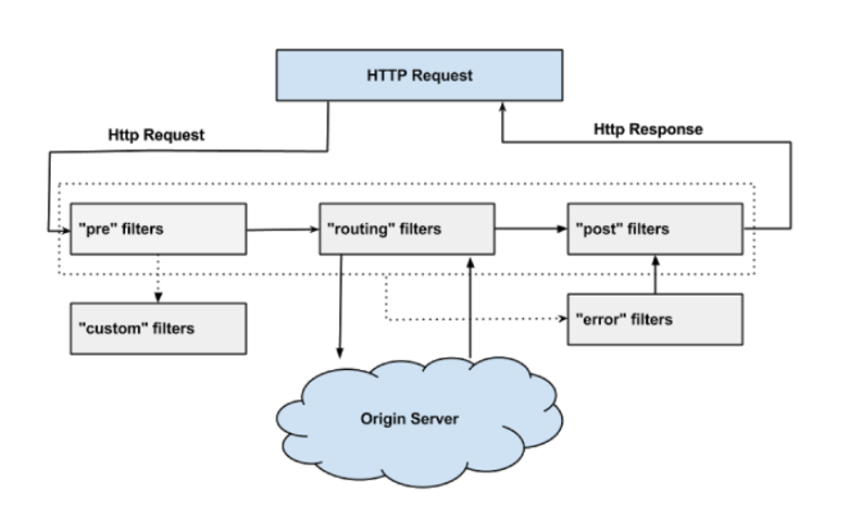

# 路由网关Spring Cloud Zuul

Zuul作为微服务系统的网关组件，用于构建边界服务(Edge Service),致力于动态路由，过滤，监控，弹性伸缩和安全。

## 1.为什么要用Zuul?

Zuul作为路由网关组件，在微服务架构中有着非常重要的作用，主要体现在以下六个方面:

- Zuul,Ribbon以及Eureka相结合，可以实现智能路由和负载均衡的功能，Zuul能够将请求流量按照某种策略分发到集群状态的多个服务实例。
- 网关将所有服务的API接口统一聚合，并统一对外暴漏。
- 网关服务可以用作身份认证和权限认证，防止非法请求操作API接口，对服务器起到保护作用。
- 网关可以实现监控功能，实时日志输出，对请求进行记录。
- 网关可以用来实现流量监控，在高流量情况下，对服务进行降级。
- API接口从内部分离出来，方便做测试。

## 2. Zuul的工作原理

Zuul是通过Servlet来实现的，Zuul通过自定义的ZuulServlet(类似于SpringMVC 的DispatcServlet)来对请求进行控制,Zuul的核心是一系列过滤器，可以在Http请求的发起和响应返回期间执行一系列的过滤器。

Zuul请求的生命周期：




## 3.案例实战

###　3.1 pom.xml

```xml
<?xml version="1.0" encoding="UTF-8"?>
<project xmlns="http://maven.apache.org/POM/4.0.0"
         xmlns:xsi="http://www.w3.org/2001/XMLSchema-instance"
         xsi:schemaLocation="http://maven.apache.org/POM/4.0.0 http://maven.apache.org/xsd/maven-4.0.0.xsd">
    <parent>
        <artifactId>eureka-demo</artifactId>
        <groupId>com.zhangxp</groupId>
        <version>1.0-SNAPSHOT</version>
    </parent>
    <modelVersion>4.0.0</modelVersion>

    <artifactId>eureka-zuul-client</artifactId>

    <dependencies>


        <dependency>
            <groupId>org.springframework.cloud</groupId>
            <artifactId>spring-cloud-starter-netflix-eureka-client</artifactId>
        </dependency>

        <dependency>
            <groupId>org.springframework.cloud</groupId>
            <artifactId>spring-cloud-starter-netflix-zuul</artifactId>
        </dependency>


        <dependency>
            <groupId>org.springframework.boot</groupId>
            <artifactId>spring-boot-starter-web</artifactId>
        </dependency>


        <dependency>
            <groupId>org.springframework.boot</groupId>
            <artifactId>spring-boot-starter-test</artifactId>
            <scope>test</scope>
        </dependency>

    </dependencies>
</project>
```

### 3.2 编写启动类,开启Zuul

```java
package com.zhangxp;

import org.springframework.boot.SpringApplication;
import org.springframework.boot.autoconfigure.SpringBootApplication;
import org.springframework.cloud.netflix.eureka.EnableEurekaClient;
import org.springframework.cloud.netflix.zuul.EnableZuulProxy;

@SpringBootApplication
@EnableEurekaClient
// 开启Zuul功能
@EnableZuulProxy
public class EurekaZuulClientApplicaiton {
    public static void main(String[] args) {
        SpringApplication.run(EurekaZuulClientApplicaiton.class, args);
    }
}

```

### 3.3 编写配置文件,配置zuul

```yaml
spring:
  application:
    name: service-zuul
server:
  port: 5000
eureka:
  client:
    service-url:
      defaultZone: http://localhost:8761/eureka/
zuul:
  routes:
    hiapi:
      path: /hiapi/** # 将/hiapi/开头的请求路由到eureka-client服务上
      serviceId: eureka-client
    ribbonapi:
      path: /ribbonapi/**
      serviceId: eureka-ribbon-client
    feignapi:
      path: /feignapi/**
      serviceId: eureka-feign-client
```

### 3.4 在Zuul上配置熔断器

默认情况下,zuul上继承了ribbon,实现了负载均衡的功能。下面，讲解一下如何实现熔断的功能：

在Zuul中实现熔断功能需要实现FallbackProvider的接口，实现该接口有两个方法：一个是getRoute()方法，用于指定熔断器功能应用于哪些路由的服务；另一个方法是fallbackResponse()为进入熔断功能时执行的逻辑。

```java
package com.zhangxp;

import org.springframework.http.HttpHeaders;
import org.springframework.http.HttpStatus;
import org.springframework.http.MediaType;
import org.springframework.http.client.ClientHttpResponse;
import org.springframework.stereotype.Component;
import org.springframework.cloud.netflix.zuul.filters.route.FallbackProvider;

import java.io.ByteArrayInputStream;
import java.io.IOException;
import java.io.InputStream;

// 通过实现FallbackProvider接口的两个方法来配置熔断
@Component
public class MyFallbackProvider implements FallbackProvider{
    @Override
    // 指定熔断功能应用于哪些服务
    public String getRoute() {
        return "eureka-client";
//        return "*"; // 全部服务上开启熔断功能
    }

    // 进入熔断功能时执行的逻辑
    @Override
    public ClientHttpResponse fallbackResponse(String route, Throwable cause) {
        return new ClientHttpResponse() {
            @Override
            public HttpStatus getStatusCode() throws IOException {
                return HttpStatus.OK;
            }

            @Override
            public int getRawStatusCode() throws IOException {
                return 200;
            }

            @Override
            public String getStatusText() throws IOException {
                return "OK";
            }

            @Override
            public void close() {

            }

            @Override
            public InputStream getBody() throws IOException {
                return new ByteArrayInputStream("oooops! error, i'm the fallback.".getBytes());
            }

            @Override
            public HttpHeaders getHeaders() {
                HttpHeaders headers = new HttpHeaders();
                headers.setContentType(MediaType.APPLICATION_JSON);
                return headers;
            }
        };
    }
}

```

### 3.5 在Zuul上使用过滤器

# 服务网关

